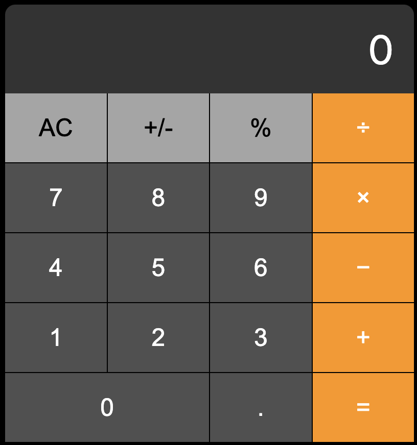

# Calculadora Estilo iPhone 📱

Este é um projeto de uma calculadora funcional que replica o visual e a experiência da calculadora do iPhone. Desenvolvido com HTML, CSS e JavaScript, esta calculadora é responsiva e compatível com os principais navegadores. Além disso, você pode utilizá-la tanto com o mouse quanto com o teclado do seu computador.



## 🚀 Demonstração

Você pode ver a aplicação em funcionamento [aqui](https://digonexs.github.io/apple-calculator/).

## 🎯 Funcionalidades

- **Interface Responsiva**: A calculadora se adapta a diferentes tamanhos de tela, garantindo uma experiência consistente em dispositivos móveis e desktops.
- **Operação com Teclado**: Use a calculadora diretamente com o teclado do computador, facilitando a usabilidade.
- **Compatível com Browsers Modernos**: Funciona nos principais navegadores como Chrome, Firefox, Safari e Edge.

## 🚀 Como Usar

1. **Clone este repositório**:
   ```bash
   git clone hhttps://github.com/digonexs/apple-calculator
   ```
2. **Navegue até o diretório do projeto**:
   ```bash
   cd apple-calculator
   ```
3. **Abra o arquivo `index.html`** no seu navegador preferido.

## ⌨️ Comandos do Teclado

Você pode utilizar os seguintes comandos para operar a calculadora:

- **Números (0-9)**: Insira os números.
- **. (Ponto)**: Adiciona o ponto decimal.
- **+**: Operador de soma.
- **-**: Operador de subtração.
- **x**: Operador de multiplicação (também funciona com `*`).
- **/**: Operador de divisão.
- **Enter** ou **=**: Calcula o resultado.
- **Backspace** ou **Escape**: Limpa a calculadora.
- **%**: Calcula a porcentagem.
- **±**: Alterna entre positivo e negativo.

## 🎨 Personalização

Sinta-se à vontade para modificar o estilo e adicionar novas funcionalidades à calculadora. Os arquivos CSS e JavaScript estão bem estruturados para facilitar personalizações.

## 🛠️ Tecnologias Utilizadas

- **HTML5**
- **CSS3**
- **JavaScript (ES6+)**

## 🤝 Contribuições

Contribuições são bem-vindas! Se você tiver sugestões de melhorias ou encontrar algum bug, fique à vontade para abrir uma issue ou enviar um pull request.

## 📄 Licença

Este projeto está licenciado sob a licença MIT.

---

**Feito com 💙 por [Rodrigo](https://www.linkedin.com/in/rodrigocavalcantedebarros/)**
